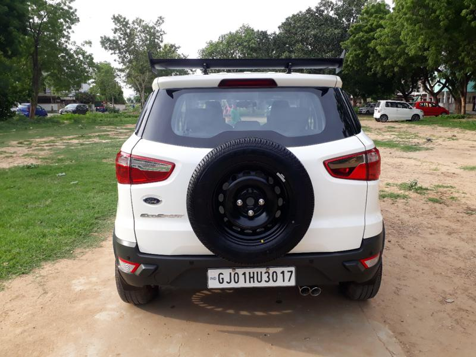

# Number-Plate-Detection
Number Plate Detection carried out with help of YOLO

The project was execute in follwoing steps :
* Creating a custom dataset.
* Labelling the dataset.
* Training the YOLO V3 Model in Darknet framework.
* testing the trained YOLO V3 model in OpenCV framework.

# Creating the Dataset
For creating the dataset, a total of 1077 car images from different angles were downloaded. It was ensured that there is no bias in the data towards a specific angle image of cars. Cars of different manufacturers, colours and sizes were taken for this data, to maintain versatility of the dataset. [Here](https://drive.google.com/drive/folders/1kkp7mTdD5HDUvXAohoynXPKSFzUc5axh?usp=sharing) is the link to the Dataset.

    

# Labelling the dataset 
For labelling the image, we use **LabelImg** software. It provides an extremely easy interface for creating annotations in Yolo format.  

 

 LabelImg interface to make annotations 

The Labels will be saved as *.txt* files in YOLO format. These *.txt* files have to be saved in the same folder that has all the images. 

YOLO format 

# Training the YOLO V3 Model in Darknet framework.
For training the data, GPU service provided by Google Colab was used. Following were the steps executed to set up training environment and train the model:
* Open a new Notebook in google colab and Mount the drive in it. 
* Clone the official darknet github repository in our notebook environment.
* Make necessary edits in darknet folder to give GPU the necessary access and configure for later use in OpenCV.
* Creating a *.cfg* file for training our custom dataset.
* Various file (like *obj.names*, *obj.data*, etc) are created.
* Images are extracted in obj folder and the names are saved in *train.txt*.
* The Network is trained. 

We trained our model till 3000 iterations. [*Train_YoloV3_car.ipynb*](https://github.com/mohit138/Number-Plate-Detection/blob/master/Car_number_plate/Train_YoloV3_car.ipynb) is the the Training Notebook and [here](https://drive.google.com/drive/folders/1kkp7mTdD5HDUvXAohoynXPKSFzUc5axh?usp=sharing) is the link to Trained Weights.

# Testing the Model 
The Trained Model is tested in OpenCV framework. [*yolo_car_number_plate_detection.py*](https://github.com/mohit138/Number-Plate-Detection/blob/master/Car_number_plate/yolo_car_number_plate_detection.py) script is used to apply the model on given images and extract out the Number Plate from the image. Following are the results obtained:

   
 
  
 

